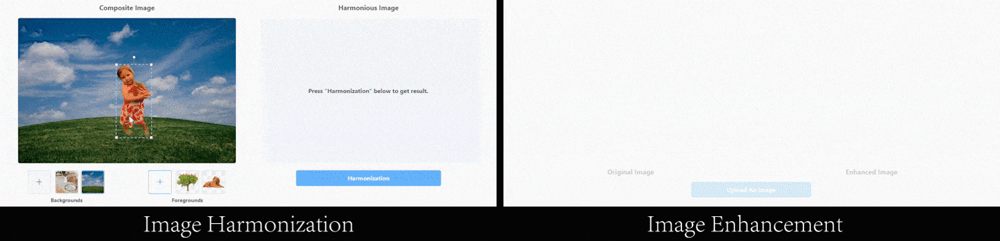

<h2 align="center">Harmonizer: High-Resolution Image/Video Harmonization</h2>

<p align="center"><i>Harmonizer: Learning to Perform White-Box
Image and Video Harmonization (ECCV 2022)</i></p>

<p align="center">
  <a href="https://arxiv.org/abs/2207.01322">Paper</a> |
  <a href="#demo">Demo</a> |
  <a href="#code">Code</a> |
  <a href="#license">License</a> |
  <a href="#citation">Citation</a> |
  <a href="#contact">Contact</a>
</p>

<p align="center">
  <a href="https://youtu.be/kKKK3D1f_Mc">Harmonizer Result Video</a> |
  <a href="https://youtu.be/NS8f-eJY9cc">Enhancer Result Video</a>
</p>

<div align="center"><b>Harmonizer</b> is a <b>lightweight (20MB)</b> model enabled image/video harmonization up to <b>8K</b> resolution.</div>
<div align="center">With GPUs, Harmonizer has <b>real-time</b> performance at <b>Full HD</b> resolution.</div>


<div align="center"><b>Enhancer</b> is a model applied the Harmonizer architecture for image/video color enhancement.</div>


---

## Demo

In our demos, the <b>Harmonizer</b> model is trained on the *iHarmony4* dataset, while the <b>Enhancer</b> model is trained on the *FiveK + HDRPlus* datasets.

### Online Demo
Try our online demos for fun without code!

| Image Harmonization | Image Enhancement |
| :---: | :---: |
| [Online Demo](https://zhke.io/?harmonizer_demo) | [Online Demo](https://zhke.io/?enhancer_demo) |



### Offline Demo
We provide offline demos for image/video harmonization/enhancement.

| Image Harmonization | Video Harmonization | Image Enhancement | Video Enhancement |
| :---: | :---: | :---: | :---: |
| [Offline Demo](demo/image_harmonization) | [Offline Demo](demo/video_harmonization) | [Offline Demo](demo/image_enhancement) | [Offline Demo](demo/video_enhancement) |


## Code

### Training

The training code is released in the folder `./src/train`.  
Refer to [README.md](src/train/README.md) for more details about training.


### Validation

We provide PyTorch validation code to reproduce the iHarmony4 results reported in our [paper](https://arxiv.org/abs/2207.01322), please:

1. Download the Harmonizer model pre-trained on the iHarmony4 dataset from [this link](https://drive.google.com/file/d/15XGPQHBppaYGnhsP9l7iOGZudXNw1WbA/view?usp=sharing) and put it in the folder `./pretrained`.

2. Download the four subsets of iHarmony4 from [this repository](https://github.com/bcmi/Image-Harmonization-Dataset-iHarmony4) and put them in the folder `./dataset/harmonization/iHarmony4`.

3. Install python requirements. In the root path of this repository, run: 
    ```
    pip install -r src/requirements.txt
    ```

5. For validation, in the root path of this repository, run:
    ```
    python -m src.val_harmonizer \
           --pretrained ./pretrained/harmonizer \
           --datasets HCOCO HFlickr HAdobe5k Hday2night \
           --metric-size 256
    ```
    - You can change `--datasets` to validate a specific subset.  
    - You can remove `--metric-size` to calculate the metrics without resizing the outputs.
    - The metric values may slightly different from our [paper](https://arxiv.org/abs/2207.01322) due to the dependency versions.

## License
This project is released under the [Creative Commons Attribution NonCommercial ShareAlike 4.0](https://creativecommons.org/licenses/by-nc-sa/4.0/legalcode) license.


## Citation
If this work helps your research, please consider to cite:

```bibtex
@InProceedings{Harmonizer,
  author = {Zhanghan Ke and Chunyi Sun and Lei Zhu and Ke Xu and Rynson W.H. Lau},
  title = {Harmonizer: Learning to Perform White-Box Image and Video Harmonization},
  booktitle = {European Conference on Computer Vision (ECCV)},
  year = {2022},
}
```


## Contact
This repository is maintained by Zhanghan Ke ([@ZHKKKe](https://github.com/ZHKKKe)).  
For questions, please contact `kezhanghan@outlook.com`.
